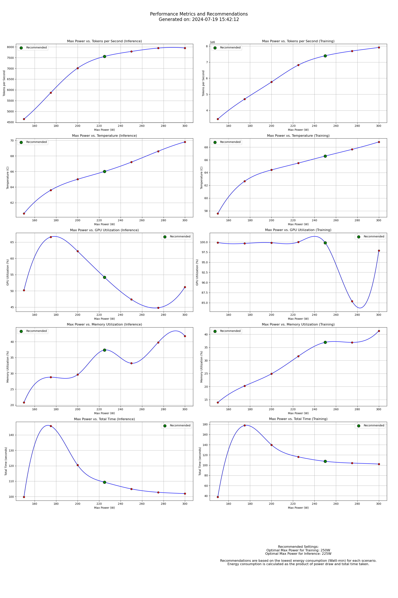

# GPU Performance Metrics and Recommendations

> [!CAUTION]
> **This was written by GPT-4o** with guidance. It's incomplete and needs human review. Use appropriately and PRs are welcome.

> This project analyzes GPU performance metrics from AI training and inference tasks, highlighting the optimal power settings for efficient operation. It generates visualizations to help identify the best max power settings for training and inference based on energy consumption.

Example report:


## Dependencies

### Install System Dependencies

Ensure the necessary NVIDIA libraries and tools are installed:

- NVIDIA CUDA Toolkit
- NVIDIA driver
- NVIDIA System Management Interface (nvidia-smi)

To install the NVIDIA driver and tools, follow the instructions on the official NVIDIA documentation:

- [NVIDIA CUDA Installation Guide for Linux](https://docs.nvidia.com/cuda/cuda-installation-guide-linux/)
- `nvidia-smi` is typically included with the NVIDIA driver installation.

### Install Python Dependencies

Install the dependencies using pip:

```bash
pip install -r requirements.txt
```

## Usage

### 1. Run Experiments

The `run_experiments.py` script orchestrates the running of experiments and data collection. This script will use `llm_inference.py` and `llm_training.py` to collect raw data.

```bash
python run_experiments.py
```

### 2. Process Experiment Data

The `process_experiment_data.py` script processes the raw experiment data into a more usable format. It will generate `training_stats.csv` and `inference_stats.csv`.

```bash
python process_experiment_data.py
```

### 3. Generate Plots and Recommendations

The `generate_report.py` script generates visualizations and highlights the recommended max power settings based on the provided data.

```bash
python generate_report.py
```

### 4. Viewing the Output

The output image `report.png` contains the following:

- **Header**: Current date and time of generation.
- **Charts**: Visualizations for both inference and training metrics side by side.
- **Summary**: Recommended settings based on energy consumption.

## Explanation of Recommendations

The recommended settings are based on the lowest energy consumption (Watt-min) for each scenario. Energy consumption is calculated as the product of power draw and total time taken. The scripts also record **energy per token**, calculated as the instantaneous power draw divided by the token generation rate.

## File Descriptions

- `training_stats.csv`: Contains columns such as `max_watt`, `tokens_per_sec`, `total_power_draw`, `energy_per_token`, `temperature`, `gpu_utilization`, `memory_utilization`, `loss`, and `timestamp`.
- `inference_stats.csv`: Contains columns such as `max_watt`, `tokens_per_sec`, `total_power_draw`, `energy_per_token`, `temperature`, `gpu_utilization`, `memory_utilization`, and `timestamp`.
- `generate_report.py`:
  - Loads data from CSV files.
  - Cleans data by removing outliers.
  - Calculates average metrics for each max power setting.
  - Generates smooth curve plots and highlights recommended settings.
  - Adds a header and summary to the output image.
- `recommend.py`:
  - Loads data from CSV files.
  - Calculates summary statistics for each max power setting.
  - Recommends the optimal max power settings based on energy consumption.
  - Can be run standalone or used as a module in other scripts.
- `gpu_metrics_utils.py`: Utility functions for processing and analyzing GPU metrics.
- `llm_inference.py`: Contains functions and scripts for running inference on large language models.
- `llm_training.py`: Contains functions and scripts for training large language models.
- `process_experiment_data.py`: Processes raw experiment data into a more usable format.
- `run_experiments.py`: Orchestrates the running of experiments and data collection.
- `clean.sh`: Script to clean up generated files such as logs, CSVs, and images.

## License

This project is licensed under the MIT License.
